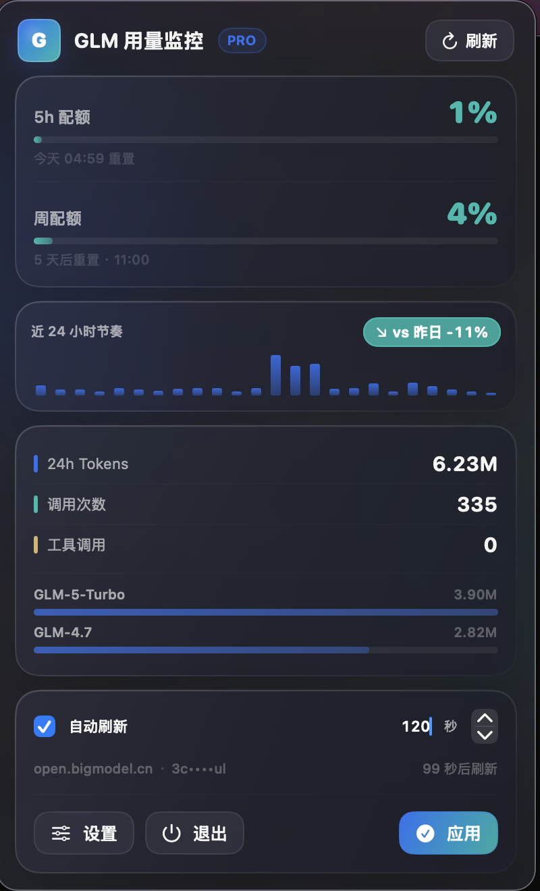
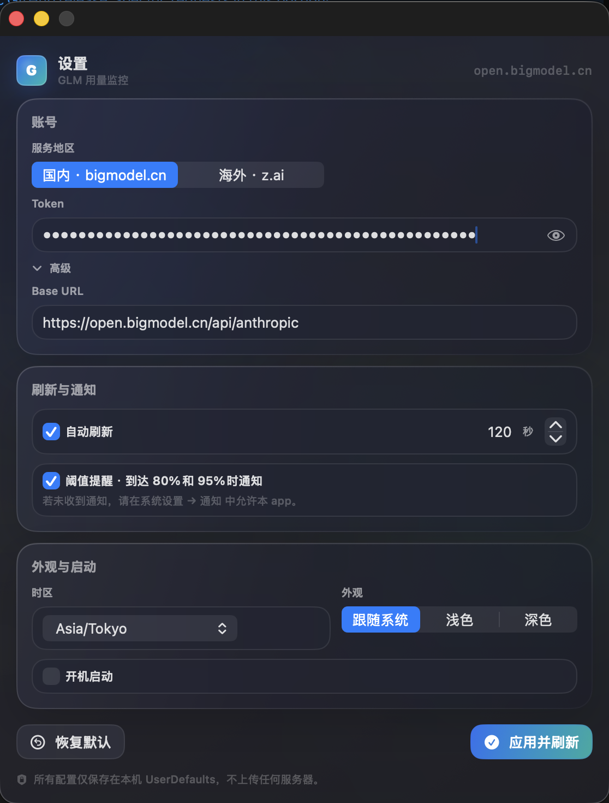

# GLM 用量监控 · GLM Pulse

A native macOS menu bar app that keeps an eye on your GLM (智谱 / Z.AI) token quota — at a glance, all the time.

一款常驻菜单栏的原生 macOS 小工具，时刻盯着你的 GLM（智谱 / Z.AI）Token 用量。

> **English** below · [中文说明](#中文说明)

---

<p align="center">
  
  &nbsp;&nbsp;
  
</p>

## English

### What it does

- Lives in your macOS menu bar as a tiny `● G 4%` indicator
- Color-coded dot (teal · orange · red) so you can spot quota pressure peripherally
- Click for a glassy popover with:
  - Weekly + 5-hour quota with progress
  - 24-hour token sparkline with **vs. yesterday** comparison
  - Top models breakdown
  - One-click refresh, copy snapshot to clipboard (⌘C)
- Right-click for native quick actions: refresh · settings · quit
- Optional desktop notifications at 80 % and 95 % weekly
- Works with both **bigmodel.cn** (China) and **z.ai** (global)
- Fully bilingual (简体中文 · English)
- 100 % local — your token stays in macOS UserDefaults, nothing ever leaves your machine

### Install

1. Download the latest `GLM 用量监控.dmg` from the [Releases](../../releases) page
2. Open the dmg, drag the app to `/Applications`
3. **First-time launch:** because the app isn't notarized with Apple yet, macOS will refuse to open it.
   Right-click the app → **Open** → confirm in the dialog.
   You only need to do this once.

### Get your API token

- **China users** → sign in at [bigmodel.cn](https://bigmodel.cn/) → API Keys → copy the key
- **Global users** → sign in at [z.ai](https://z.ai/) → API Keys → copy the key

Paste the token into the welcome window the first time you launch the app. Done.

### Privacy

- Your token, base URL, and every other setting are stored **only** in macOS UserDefaults on your machine.
- The app talks to **only** the GLM API endpoint you configure — no analytics, no telemetry, no remote logging.
- Source is open. Audit it yourself.

### Build from source

Requirements: macOS 13+, Xcode 15+ (or Swift 5.9 toolchain).

```bash
git clone https://github.com/dkekzk/glm-token-monitor-app.git
cd glm-token-monitor-app
./scripts/build-app.sh                # builds output/GLM 用量监控.app
./scripts/make-dmg.sh                 # bundles a signed .dmg
```

The build script ad-hoc signs the bundle (`codesign -s -`) so it can launch
without "app is damaged" errors on your own machine.

### License

[MIT](LICENSE)

---

## 中文说明

### 它是干嘛的

- 常驻 macOS 菜单栏，显示 `● G 4%` 这种迷你指示器
- 配色点（青 · 橙 · 红）让你余光就能看到额度紧不紧
- 点开是一张磨砂玻璃风的面板：
  - 周配额 + 5 小时配额进度
  - 近 24 小时 Token sparkline，带 **vs 昨日** 对比
  - 主要模型用量分解
  - 一键刷新、⌘C 复制用量快照
- 右键菜单：立即刷新 · 设置 · 退出
- 可选 80% / 95% 阈值桌面通知
- 同时支持 **bigmodel.cn**（国内）和 **z.ai**（海外）
- 中英双语
- 100% 本地，Token 仅保存在 macOS UserDefaults，不上传任何服务器

### 安装

1. 去 [Releases](../../releases) 下载最新的 `GLM 用量监控.dmg`
2. 打开 dmg，把 app 拖进 `/Applications`
3. **首次启动**：因为 app 还没拿到 Apple 公证签名，macOS 会拒绝打开。
   右键 app → **打开** → 在弹窗里确认。
   只要做这一次。

### 获取 API Token

- **国内用户** → 登录 [bigmodel.cn](https://bigmodel.cn/) → API Keys → 复制
- **海外用户** → 登录 [z.ai](https://z.ai/) → API Keys → 复制

首次启动时把 Token 粘贴到欢迎窗口即可。

### 隐私

- Token、Base URL、其他配置仅保存在本机 UserDefaults
- App 只与你配置的 GLM API endpoint 通信，无任何分析、遥测、远程日志
- 源码开源，欢迎审查

### 从源码构建

环境：macOS 13+，Xcode 15+ 或 Swift 5.9。

```bash
git clone https://github.com/dkekzk/glm-token-monitor-app.git
cd glm-token-monitor-app
./scripts/build-app.sh                # 构建出 output/GLM 用量监控.app
./scripts/make-dmg.sh                 # 打包成签名后的 .dmg
```

构建脚本会用 `codesign -s -` 做 ad-hoc 签名，确保能在本机无报错启动。

### 协议

[MIT](LICENSE)
